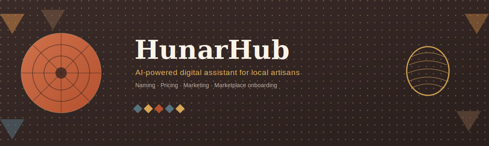
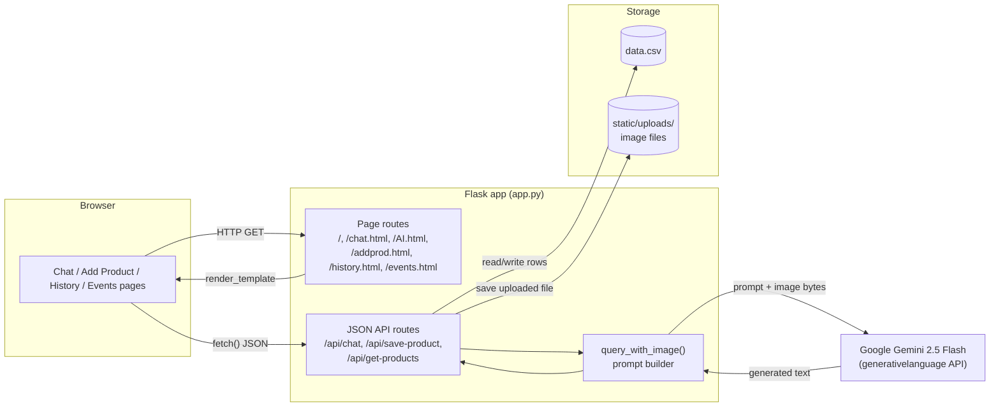
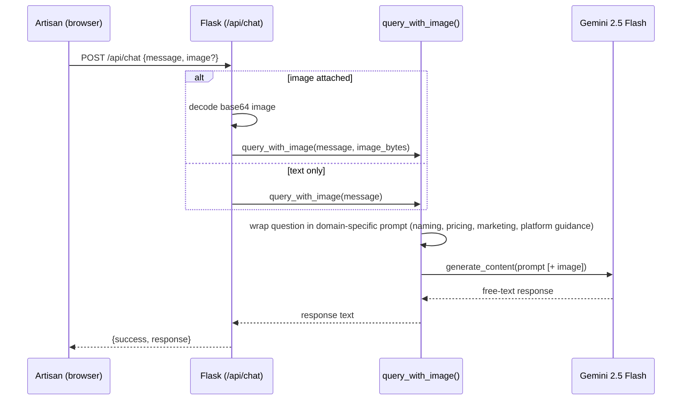
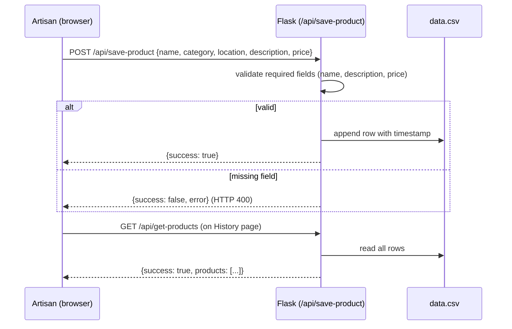
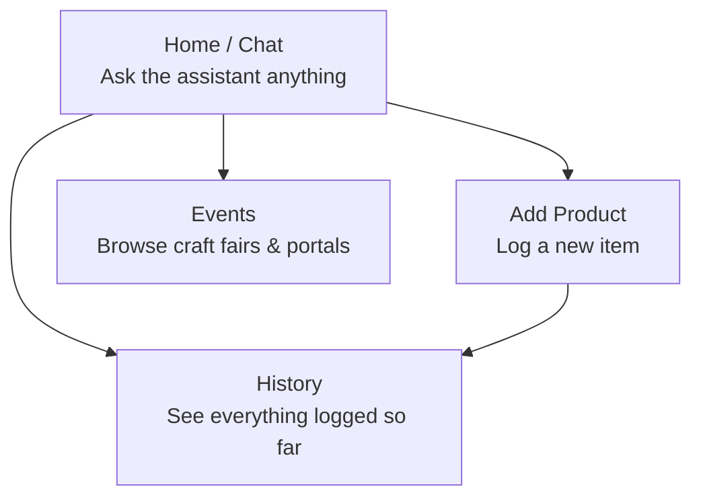

<p align="center">
  
</p>

<h1 align="center">HunarHub</h1>
<p align="center"><b>An AI-powered digital assistant that helps local artisans price, describe, and market their handmade products online.</b></p>

<p align="center">
  
  
  
  
</p>

<p align="center">
  <a href="https://hunarhub.onrender.com/">Live demo link</a> ·
  <a href="https://drive.google.com/file/d/18IvMMVZYv6FmSWJYW3hKIAIQG5-gvoCe/view?usp=sharing">Demo video link</a>
</p>

---

## Table of contents

1. [Overview](#overview)
2. [Why HunarHub](#why-hunarhub)
3. [Feature summary](#feature-summary)
4. [Screenshots](#screenshots)
5. [Architecture](#architecture)
6. [How a request flows through the app](#how-a-request-flows-through-the-app)
7. [Data model](#data-model)
8. [Tech stack](#tech-stack)
9. [Project structure](#project-structure)
10. [Getting started](#getting-started)
11. [Environment variables](#environment-variables)
12. [API reference](#api-reference)
13. [Navigation map](#navigation-map)
14. [Roadmap](#roadmap)
15. [Contributing](#contributing)
16. [License](#license)

---

## Overview

HunarHub is a prototype web app that acts as a digital mentor for local
artisans — potters, weavers, block-print makers, and other handicraft
producers — who want to sell online but don't know where to start. Instead
of a generic chatbot, the assistant is scoped specifically to the artisan
onboarding problem: given a photo and a question, it suggests a product
name, a description, a price aligned with market trends, and guidance for
listing on platforms like **Meesho**, **Amazon Karigar**, and **Etsy**.

The app is built with Flask on the backend and calls **Google Gemini
2.5 Flash** as its reasoning engine, with a small set of pages for chat,
product logging, sales history, and craft-fair events.

> **Prototype status.** This is a hackathon-stage build. The
> [Known limitations](#known-limitations) and [Roadmap](#roadmap) sections
> below are written deliberately honestly — see those before assuming any
> capability not explicitly described here.

## Why HunarHub

Millions of artisans in India and elsewhere produce high-quality handmade
goods but have no digital presence, because the gap isn't skill — it's
**translation**: turning a physical craft into a listing with the right
name, price, description, and platform. HunarHub's premise is that an AI
assistant with domain-specific prompting (not a general chatbot) can close
part of that gap by acting as a first-pass mentor before the artisan talks
to a human program officer or NGO facilitator.

## Feature summary

| Feature | What it does | Status |
|---|---|---|
| AI chat assistant | Ask questions about naming, pricing, marketing, or platform onboarding; optionally attach a product photo | ✅ Implemented |
| Image-grounded suggestions | Gemini analyzes an uploaded photo alongside the question | ✅ Implemented |
| Add Product | Manually log a product (name, category, location, description, price) | ✅ Implemented |
| Sales/product history | View everything logged so far | ✅ Implemented |
| Events | Browse curated craft fairs and government handicraft portals | ⚠️ Static content, not data-driven |
| Multi-turn memory of the artisan | Assistant recalls the artisan's craft type and past products | 🔜 Planned |
| Chat → Add Product autofill | One click carries an AI suggestion into the product form | 🔜 Planned |
| Feedback on suggestions | Thumbs up/down on AI responses | 🔜 Planned |
| Persistent database (SQLite) | Replace CSV storage, add per-artisan accounts | 🔜 Planned |

## Screenshots


## Architecture

HunarHub is a single Flask service. There is no separate backend/frontend
split — Flask renders Jinja templates directly, and a handful of pages
call small JSON API endpoints for chat and product data. Product records
currently persist to a flat CSV file (`data.csv`); this is the first item
in the [Roadmap](#roadmap) to change.



## How a request flows through the app

Two flows cover almost everything the app does: **asking the assistant a
question**, and **logging a product**.

### 1. Asking the assistant (with or without a photo)



The prompt itself is intentionally constrained: it instructs Gemini to
only answer questions related to art, handicrafts, and marketplace
onboarding, and to ignore anything outside that scope. This is what keeps
the assistant feeling like a domain mentor instead of a general chatbot.

### 2. Logging a product



## Data model

Current storage (`data.csv`) — a single flat table, no relationships, no
per-artisan scoping:

| Column | Description |
|---|---|
| `Image` | Filename or placeholder string |
| `Name` | Product name |
| `Category` | Product category |
| `Location` | Artisan's location |
| `Description` | Product description |
| `Price` | Price as entered |
| `Date_Added` | Server timestamp at save time |

This is intentionally simple for a prototype, but has two real
consequences worth knowing before extending the app: concurrent writes
are not locked (two simultaneous saves can interleave badly), and there is
no way to tell which artisan a row belongs to. Both are addressed in the
[Roadmap](#roadmap).

## Tech stack

| Layer | Choice |
|---|---|
| Web framework | [Flask 3.1](https://flask.palletsprojects.com/) |
| AI model | [Google Gemini 2.5 Flash](https://ai.google.dev/) via `google-generativeai` |
| Image handling | Pillow (`PIL`) |
| Data handling | `pandas` (CSV read), stdlib `csv` (CSV write) |
| Config | `python-dotenv` |
| Templating | Jinja2 (server-rendered HTML, vanilla JS on the client — no frontend framework) |
| Deployment | Gunicorn, currently hosted on [Render](https://hunarhub.onrender.com/) |

Full pinned versions are in [`requirements.txt`](requirements.txt).

## Project structure

```
HunarHub-main/
├── app.py                  # All routes, prompt logic, CSV I/O
├── data.csv                # Product records (flat-file storage)
├── requirements.txt        # Pinned Python dependencies
├── assets/
│   └── banner.png           # README banner
├── static/
│   └── uploads/             # Images uploaded via the /ai-chat form
└── templates/
    ├── chat.html             # Home / chat interface
    ├── AI.html                # Form-based chat variant (server-rendered response)
    ├── addprod.html           # Add Product form
    ├── history.html           # Product history table
    ├── Events.html             # Static craft-fair / portal listings
    └── aboutapp.html           # About page
```

## Getting started

### Prerequisites
- Python 3.10+
- A Google AI Studio API key with access to Gemini ([aistudio.google.com](https://aistudio.google.com/))

### Setup

```bash
# 1. Clone the repository
git clone https://github.com/<your-org>/HunarHub.git
cd HunarHub-main

# 2. Create and activate a virtual environment
python -m venv venv
source venv/bin/activate      # Windows: venv\Scripts\activate

# 3. Install dependencies
pip install -r requirements.txt

# 4. Configure environment variables (see below)
echo "API_KEY=your_gemini_api_key_here" > .env

# 5. Run the app
python app.py
```

The app starts on `http://localhost:5000` by default (or `$PORT` if set,
matching the Render deployment config).

## Environment variables

| Variable | Required | Description |
|---|---|---|
| `API_KEY` | Yes | Google AI Studio / Gemini API key, loaded via `python-dotenv` |
| `PORT` | No | Port to bind to (defaults to `5000`) |

## API reference

| Method | Route | Purpose | Request body | Response |
|---|---|---|---|---|
| `GET` | `/` | Home page (chat) | — | HTML |
| `GET` | `/chat.html` | Chat interface | — | HTML |
| `GET` | `/AI.html` | Form-based chat variant | — | HTML |
| `POST` | `/ai-chat` | Submit a question ± image via form upload | multipart form: `question`, `image` | HTML (rendered with answer) |
| `GET` | `/addprod.html` | Add Product form | — | HTML |
| `GET` | `/history.html` | Product history page | — | HTML |
| `GET` | `/events.html` | Craft fair / portal listings | — | HTML |
| `GET` | `/aboutapp.html` | About page | — | HTML |
| `POST` | `/api/chat` | Ask the assistant (JSON, used by chat.html) | `{"message": str, "image": base64_str?}` | `{"success": bool, "response": str}` |
| `POST` | `/api/save-product` | Log a new product | `{"name", "description", "price", "category"?, "location"?, "image"?}` | `{"success": bool, "message"?, "error"?}` |
| `GET` | `/api/get-products` | Fetch all logged products | — | `{"success": bool, "products": [...]}` |

## Navigation map



The intended flow: an artisan opens the chat, asks for naming/pricing/
description help (optionally with a photo), manually transfers that
advice into **Add Product**, then checks **History** to see everything
they've listed, and **Events** for offline/online opportunities to sell
or showcase work.

## Roadmap

Planned in this order, since each later step depends on the one before it:

1. **SQLite migration + lightweight session-based route protection** —
   replace `data.csv` with a proper schema (`artisans`, `products`,
   `chat_messages`, `feedback`) and give each artisan a session so their
   data is scoped to them.
2. **Chat → Add Product autofill** — parse a structured suggestion out of
   Gemini's response and let the artisan carry it into the product form
   with one click instead of retyping it.
3. **Artisan memory** — feed the artisan's profile and recent product
   history back into the prompt so suggestions stay consistent over time.
4. **Feedback loop** — thumbs up/down on AI suggestions, stored per
   artisan, to start measuring whether advice is actually useful.
5. **Market-grounded pricing** — reason over a real reference dataset of
   comparable listings instead of a model estimate.
6. **Dynamic events** — replace the static Events page with a maintained,
   fetched data source.

## Contributing

This is currently a solo/hackathon project. If you'd like to contribute,
open an issue describing the change before submitting a pull request —
particularly for anything touching the data model, since it's mid-migration
per the roadmap above.

## License

No license file is currently included in this repository. Until one is
added, all rights are reserved by the project author — please open an
issue if you'd like to use this code and need clarification on terms.
